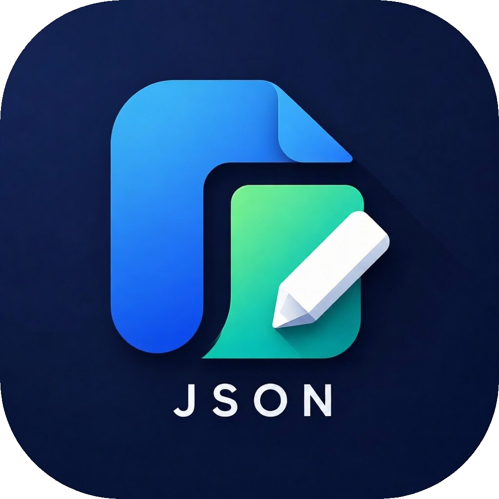

# JsonPilot

<p align="center">
  
</p>

<p align="center"><strong>Navigate and Edit JSON with Precision</strong></p>

<p align="center">
  <em>A fast, native desktop JSON editor with a clean tree-based UI, built for developers who work with large structured JSON files every day.</em>
</p>

---

## Features

**Tree-based JSON Editor** — Browse and edit deeply nested JSON structures in a collapsible tree view. Double-click any key or value to edit inline. Full undo/redo stack (up to 50 levels) with visual diff markers highlighting added, modified, and deleted nodes.

**Session / Project Management** — Organize your work into named sessions, each pointing to a different directory. The sidebar lists all sessions with expand/collapse file trees. Add, rename, delete sessions, or create new files and folders directly from the context menu.

**Search & Replace** — Find any key, value, or string across the entire JSON document. Replace in a specific scope (current node, current value) or globally. All matches highlighted in real time.

**Dark & Light Themes** — Toggle between dark and light themes with a single click. The title bar color follows the selected theme. Theme persists across sessions via `config.json`.

**Drag & Drop** — Drag any `.json` file from your file explorer directly into the editor window to open it.

## Build Environment

### Prerequisites

| Component | Version | Notes |
|-----------|---------|-------|
| **CMake** | 3.18+ | Build system |
| **Visual Studio** | 2022 | With C++ Desktop Development workload (MSVC toolchain) |
| **Windows SDK** | 10.0+ | Required for WebView2 support |
| **WebView2 Runtime** | Any | Pre-installed on Windows 10/11 |

## Building from Source

```powershell
# 1. Clone the repository
git clone https://github.com/zhongqingg/JsonPilot.git
cd JsonPilot

# 2. Configure with CMake (Release)
cmake -B build -S . -G "Visual Studio 17 2022" -A x64

# 3. Build
cmake --build build --config Release

# 4. The executables are at:
#    build\Release\JsonPilotBackend.exe
#    build\Release\JsonPilotViewer.exe
```

## Usage

**JsonPilot** uses a dual-process architecture:
- **JsonPilotBackend.exe** — headless HTTP+WebSocket server, auto-starts at boot. Manages file I/O, session configuration, and serves the web UI.
- **JsonPilotViewer.exe** — the desktop window you interact with. Launches the backend if needed and connects to it.

Launch the viewer directly — it handles everything:

```powershell
# Open the viewer (backend starts automatically if not running)
JsonPilotViewer.exe

# Open a specific JSON file
JsonPilotViewer.exe path\to\file.json

# Associate .json files (done by installer):
# Double-click any .json file to open it in JsonPilot
```

### Managing Sessions

1. Click **+** in the sidebar to add a project session (enter a name and select a directory).
2. Expand a session to browse all `.json` files in that directory.
3. Click any file to open it in the tree editor.
4. Right-click a session header or file/folder for context menu actions (New Folder, New JSON File, Rename, Delete, Copy).
